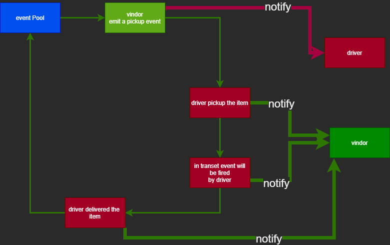
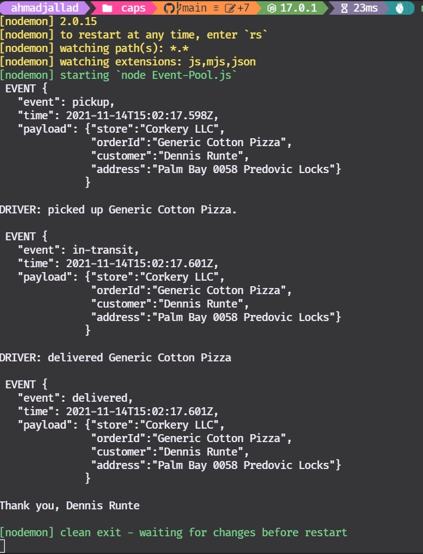
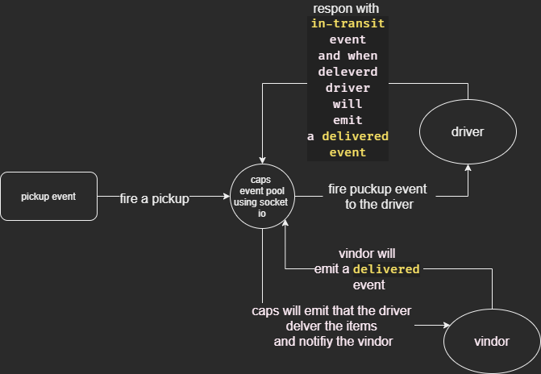

# caps

Code Academy Parcel Service caps for short is delivery management system

## Documentation

uml:




---

caps with socket.io




## with queue


## JSDoc

```js
/**
 *
 * @param {payload:"store": string,"orderId": string,"customer": string,"address": string}
 * logOrder when order is delivered
 */
const handler = (payload) => {
  console.log(`Thank you, ${payload.customer}\n`);
};
/**
 *
 * @param {payload:"store": string,"orderId": string,"customer": string,"address": string} payload
 * @param {socket} io socket
 * @returns void
 * @description handler used to log the order emit a in transit event
 * log delivered event and emit a delivered event
 * log
 */
const handler = (payload, socket) => {
  console.log(`DRIVER: picked up ${payload.orderId}.\n`);
  socket.emit("in-transit", payload);
  console.log(`DRIVER: delivered ${payload.orderId}\n`);
  socket.emit("delivered", payload);
};
/**
 * @param {payload} payload
 * @param {Diver | Vendor} type
 * @param {pickup | delivered} event
 * @param {message ID} id
 * @description use to add a message to the queue and send it to the client
 */
const addToQueue = (payload, type, event, id) => {
  if (event === "pickup") {
    type[id] = { event, payload };
  } else {
    type[payload.store] ??= {};
    type[payload.store][id] = { event, payload };
  }
};
```
